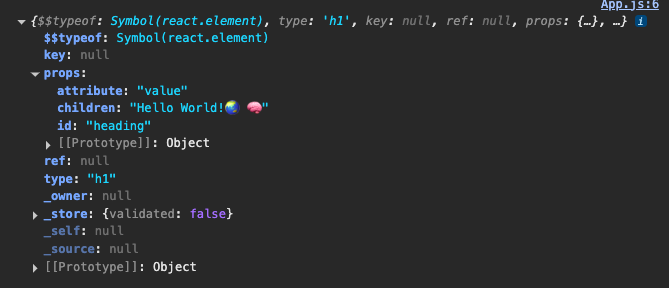

# React Food Delivery App

React is a _Javascript Library_ developed by _Facebook_

## Day - 1

### Things to remember

- VS code use Emeet (_Intellisense_)
- Browsers has Javascript engine in it
- CDN (_Content Delivery Network_)
- Cross-Origin
  - _refers to an attempt by a web browser to access a resource (like an API or a file) from a different origin than the one the web page was served from_
- React.createElement() is just an Javascript Object
- If you want to create the html elements at same level(Sibilings), you can use it by having Square brackets as [below code](#render-using-react-in-html-traditional-approach)

### Setup React

- CDN Links (_Not a recommended way_)
  - Update just above the closing tag of Body in html

### Code to remember

- Render using Javascript in html (_Traditional Approach_)

```java
    <script>
        const heading = document.createElement("h1");
        heading.innerHTML = "Hello World!🌏";
        const root = document.getElementById("root");
        root.appendChild(heading);
    </script>
```

- Render using React in html (_Traditional Approach_)

```java
  <script>
      const heading = React.createElement(
        "div",
        { id: "parent", attribute: "value" },
        [React.createElement('h1',{},"Hello World!🌏 🧠"),
        React.createElement('h5',{},'Creating the sibiling elements using Square Brackets🥹[ ]')]
      );
      const root = ReactDOM.createRoot(document.getElementById("root"));
      root.render(heading);

  </script>
```

- Props (_elements, keys, children,attribures_)
  

## Day - 2

### Things to remember

- NPM, Node Package Manager ❌
- Bundlers
  - Parcel
  - Vite
  - Webpack
- Parcel
  - `npm install parcel`
  - Dev Build
  - Local Server
  - HMR - Hot Module Replacement
  - File Watching Algorithm
  - Caching > Faster Builds
  - Image Optimization
  - Minification
  - Bundling
  - Compressing
  - Code Splitting
  - Differential bundlings
  - Error Handling
  - HTTPs
- Two Dependencies
  - Dev Dependencies
    - Required during Development phase
  - Normal Dependencies
    - Required during Production phase
- "parcel": "^2.16.0"
  - ^ Carrot symbol is for Minor upgrade
  - ~ Tilda symbol is for Major upgrade
- BrowserList in package.json

### Setup React

1. `npm init`
2. `npm install -D parcel`
3. `npx parcel index.html`
4. `npm install react`
5. `npm install react-dom`
6. run the build `npx parcel index.html`

### Code to remember

```json
//Package.json
  "devDependencies": {
    "parcel": "^2.16.0"
  },
  "dependencies": {
    "react": "^19.1.1",
    "react-dom": "^19.1.1"
  },
  "browserslist": [
    "last 2 Chrome version"
  ]
```

## Day - 3

### Things to remember

- JSX
  - JSX code translated to React.createElement and Parcel uses Babel and Parcel will ask Babel to translate our code to Javascript.
- React Component
  - Class based (_Traditional_)
  - Functional (_New_)
- Fuctional Component
  - Its a normal javascript funtion which returns the JSX code
  - **Functional Component should start with Capital letter**
- Component Composition
  - Component inside the component is called as Component Composition

### Code to remember

```javascript
//package.json to run the build
  "scripts": {
    "start": "parcel index.html",
    "build": "parcel build index.html"
  }
```

- JSX Sample code

```javascript
//React Element
const jsxHeading = <h1 id="heading">Hello World from JSX 🚀</h1>;
const root = ReactDOM.createRoot(document.getElementById("root"));
root.render(jsxHeading);
```

- Functional Component

```javascript
const Heading1 = () => {
  return (
    <div>
      <Heading />
      <h2 className="heading">I am also from Heading1 Functional Component</h2>
    </div>
  );
};

const root = ReactDOM.createRoot(document.getElementById("root"));
root.render(<Heading1 />);
```

## Day - 4

### Things to remember

- Start building the Food Delivery App
- Props are just like function arguments and attributes in HTML
- Config driven UI
- Key is a special string attribute you need to include when creating lists of elements

### Code to remember

```javascript
{
  resList.map((restaurant) => (
    <RestaurantCard key={restaurant.info.id} resData={restaurant} />
  ));
}
```

## Day - 5

### Things to remember

- Two Types of export/imports
  - Default
  - Named
- Hooks
  - These are normal functions which can be used to add extra functionalities to functional components
- useState
  - To create and manage state variables
  - Never use useState in if-else conditions/Loops/Functions
- Render
  - When a state variable is updated, the component in which that state variable is defined will re-render
- State variables
  - These are the variables which when updated will re-render the component
- useEffect
  - To run side effects in functional components
  - By default it runs after every render of the component
  - We can control it by passing a second argument to useEffect which is an array of dependencies
  - If we pass an empty array, it will run only once after the initial render (componentDidMount)
  - If we pass a state variable in the array, it will run only when that state variable changes (componentDidUpdate for that variable)
- Event handlers
- Reconciliation/Diffing Algorithm/React Fiber
  - When a state variable is updated, React will compare the new JSX with the previous JSX and will update only the changed parts in the DOM
  - This process is called Reconciliation

### Code to remember

- Default Export

```javascript
file1: export default RestaurantCard;
file2: import Header from "./components/Header";
```

- Named Export
  - When you want to export multiple components in same file

```javascript
export const Component
import {Component} from 'path'
```

## Day - 6

### Things to remember

- useEffect
- Fetch API
- Filter
- Search
- Fetch
- Shimmer

## Day - 7

### Things to remember

- react-router-dom
  - `{ createBrowserRouter, RouterProvider ,useRouteError,Outlet, useParams}`
- Children route
- Link
- Routing
  - Client Side Routing
  - Server Side Routing
